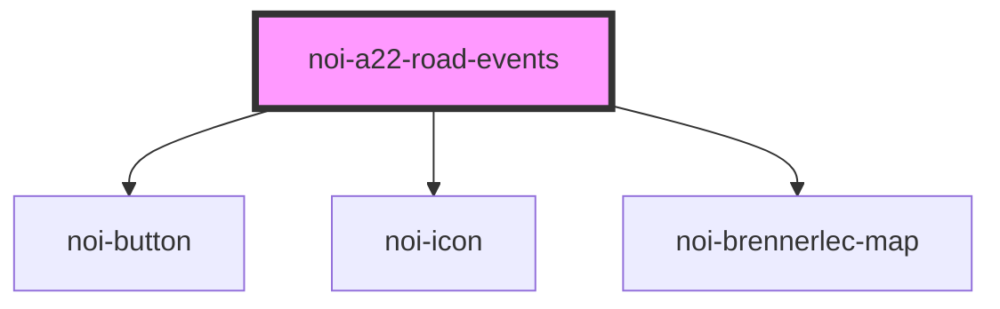

<!--
SPDX-FileCopyrightText: NOI Techpark <digital@noi.bz.it>

SPDX-License-Identifier: CC0-1.0
-->

# noi-a22-road-events

<!-- Auto Generated Below -->

## Overview

Road traffic events component

## Properties

| Property    | Attribute   | Description             | Type                                          | Default                                                  |
| ----------- | ----------- | ----------------------- | --------------------------------------------- | -------------------------------------------------------- |
| `direction` | `direction` | Events direction filter | `"both" \| "north" \| "south"`                | `'both'`                                                 |
| `language`  | `language`  | Language                | `string`                                      | `detectAllowedBrowserLanguage(['it', 'en', 'de'], 'it')` |
| `layout`    | `layout`    | Layout appearance       | `"auto" \| "desktop" \| "mobile" \| "tablet"` | `'auto'`                                                 |

## Methods

### `refreshData() => Promise<void>`

Reload camera data (basically, it's images)

#### Returns

Type: `Promise<void>`

## Shadow Parts

| Part                   | Description                     |
| ---------------------- | ------------------------------- |
| `"list-item"`          | Panel list item                 |
| `"list-item-selected"` | Panel list item when selected   |
| `"map"`                | Map                             |
| `"map-item"`           | Map marker                      |
| `"map-item-selected"`  | Map marker when selected        |
| `"menu-btn"`           | Open panel button (mobile only) |
| `"panel"`              | Info panel                      |

## CSS Custom Properties

| Name                      | Description                        |
| ------------------------- | ---------------------------------- |
| `--color-background`      | Background color                   |
| `--color-border`          | Border color                       |
| `--color-primary`         | Primary color                      |
| `--color-secondary`       | Secondary color                    |
| `--color-shade`           | Shade color for traffic info label |
| `--color-text`            | Text color                         |
| `--list-color-background` | List background color              |
| `--list-color-separator`  | List separator color               |
| `--list-color-text`       | List text color                    |
| `--map-line-color`        | Map line color                     |
| `--map-marker-color`      | Map marker color                   |
| `--map-marker-color-bg`   | Map marker background              |
| `--map-marker-highlight`  | Map marker highlight color         |
| `--scrollbar-bg`          | Scrollbar background color         |
| `--scrollbar-color`       | Scrollbar thumb color              |

## Dependencies

### Depends on

- [noi-button](../blocks/button)
- [noi-icon](../blocks/icon)
- [noi-brennerlec-map](../blocks/map)

### Graph

----------------------------------------------

*Built with [StencilJS](https://stenciljs.com/)*
